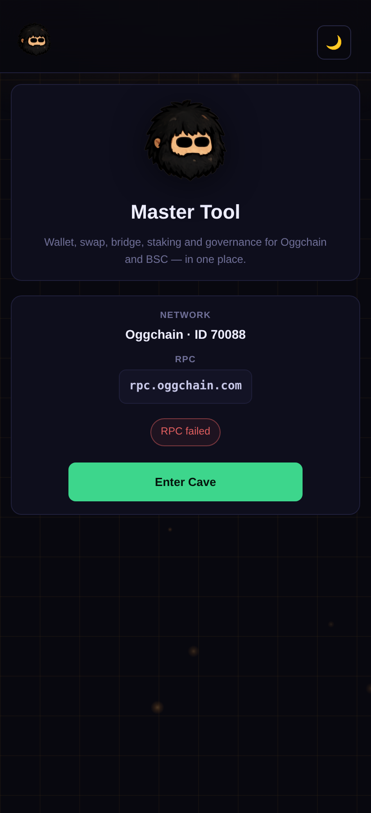
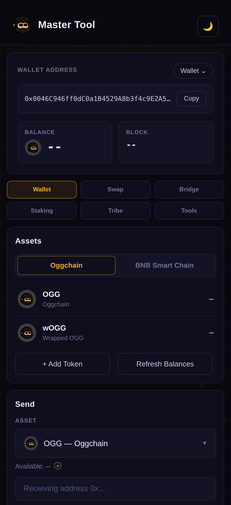
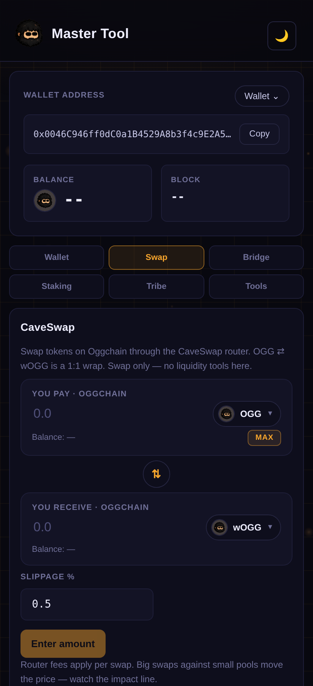
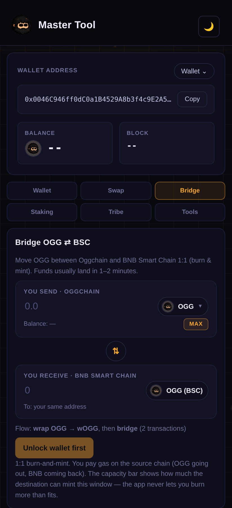
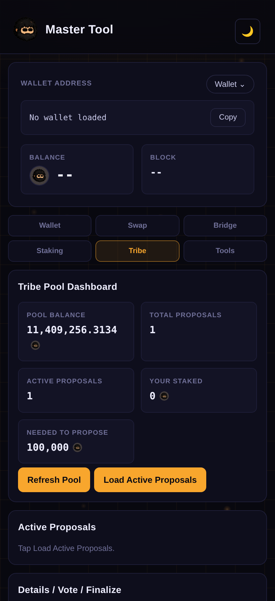

<p align="center">
  
</p>

<h1 align="center">Master Tool — OGG Mobile Wallet</h1>

<p align="center">
  <b>Wallet · Swap · Bridge · Stake · Govern</b><br/>
  The official Android Master Tool for Oggchain (OGG).
</p>

<p align="center">
  
  
  
  
  
</p>

---

## 🪨 What is this?

**Master Tool** is the official self-custody mobile wallet for the **Oggchain** network (Chain ID `70088`). It puts everything the chain offers into one clean Android app — no Termux, no browser extension, no command line, no third-party custody.

Your keys are generated and encrypted **on your device** with your own password and never leave it. Create a wallet, hold OGG across two chains, swap on CaveSwap, bridge OGG to and from BNB Smart Chain, stake, and take part in Tribe governance — all from one cave.

> Rock turns into digital copper. Tribe strong. Mine. Stake. Build. Repeat.

<p align="center">
  
  
  
</p>
<p align="center">
  
  
</p>

---

## ✨ Features

### 👛 Multi-chain wallet
- One address, two networks: **Oggchain** and **BNB Smart Chain**
- Default assets shown out of the box: **OGG**, **wOGG**, **BNB**, **OGG (BSC)**, **USDT (BSC)**
- Add any custom token on either chain — paste a contract address and the app reads its name, symbol and decimals straight from the chain
- Send native coins or tokens on either network, with an amount slider and a gas-aware **Max**
- Multiple wallets on one device, each encrypted with its own password — switch between them or add more any time

### 🔄 Swap (CaveSwap)
- Swap tokens on Oggchain through the CaveSwap router
- Live quotes, exchange rate, minimum received, and a price-impact warning
- Adjustable slippage
- **OGG ⇄ wOGG** 1:1 wrap / unwrap
- One-time token approvals handled automatically
- Swap only — no liquidity management in the app

### 🌉 Bridge (OGG ⇄ BSC)
- Move OGG between Oggchain and BNB Smart Chain **1:1** (burn & mint)
- Bridge OGG or wOGG out; OGG (BSC) back in
- Auto-wrap on the way out, auto-unwrap on arrival
- Live destination-capacity check — the app never lets you send more than the destination can mint in the current window
- Persistent bridge history with source and destination explorer links

### ⭐ Staking
- Stake and unstake OGG, track your position and pool share
- Watch your cooldown timer and withdraw once it ends
- Claim staking rewards
- Live pool stats: total staked, reward pool, estimated APR, and contract minimums

### 🏛️ Tribe governance
- View the Tribe treasury and proposal activity
- Create proposals, vote yes / no, and finalize after the voting period
- See exactly how much stake is needed to propose

### 🔒 Security & experience
- **Self-custody** — keys are encrypted locally (PBKDF2 + AES-GCM) and never uploaded
- A clear confirmation screen before every swap, bridge and send
- Log out to lock the app back to the wallet list without erasing your keys
- Warm cave-lit theme in your choice of **light or dark**

---

## 📥 Install

Download the latest **`Master-Tool.apk`** from the [Releases](../../releases) page, open it on your Android phone, and allow installation from your browser or file manager when prompted.

Requirements: **Android 7.0 (API 24) or newer**.

> ⚠️ **Back up your private key.** This is a self-custody wallet. If you lose your private key, no one — including the Oggchain team — can recover your funds. Export and store it somewhere safe before moving real value.

---

## 🌐 Network

| Item        | Value                          |
| ----------- | ------------------------------ |
| Chain       | Oggchain                       |
| Coin        | Oggcoin (OGG)                  |
| Symbol      | OGG                            |
| Chain ID    | 70088                          |
| RPC         | https://rpc.oggchain.com       |
| Explorer    | https://scan.oggchain.com      |
| Consensus   | ProgPoW (hybrid PoW / PoS)     |

### Core contracts

| Contract              | Address                                      |
| --------------------- | -------------------------------------------- |
| Staking               | `0xa47008c59f729756bEc7d01f6FE71328A242d0c4` |
| Tribe Pool            | `0x085CF5da09842FA3BA01068CC02c156198b1b114` |
| CaveSwap Router       | `0x63bF06B97B6764699715A1421F65F5DBdED54008` |
| CaveSwap Factory      | `0xeDD3931022b29F1d2EB226E978A775eE05891866` |
| wOGG                  | `0x481c52Fc0394943d3A1190e5121F63a67C072ABb` |
| Bridge (Oggchain)     | `0x9C86C959dbfD0FFe997fceF3c4b307c1a9AcFc8A` |
| Bridge (BSC)          | `0xb448CE16ec19882556Bea1171cA8D02774a5E49E` |
| OGG on BSC            | `0xC44Efba271E71351CE20F96cFAc2d1d5c2302Aa3` |

---

## 🛠️ Build from source

The app is a native Android shell around a self-contained web UI. Transactions are signed on-device with **ethers.js**; a small Java bridge relays JSON-RPC calls so the wallet works without a browser extension.

You need the **Android SDK** and **JDK 17**.

```bash
# clone
git clone https://github.com/Oggchain/OGG-Mobile.git
cd OGG-Mobile

# build a debug APK
gradle assembleDebug
# output: app/build/outputs/apk/debug/app-debug.apk
```

The included GitHub Actions workflow (`.github/workflows/build-apk.yml`) builds the APK on every push to `main` and uploads it as an artifact.

### Project structure

```
OGG-Mobile/
├── app/
│   └── src/main/
│       ├── java/org/oggcoin/wallet/
│       │   └── MainActivity.java     # Android shell + JSON-RPC bridge
│       ├── assets/
│       │   ├── index.html            # the full wallet UI (HTML/CSS/JS + ethers.js)
│       │   ├── ogg-head.png          # app / header logo
│       │   └── ogg-coin.png          # OGG coin icon
│       ├── res/                      # launcher icons, theme, strings
│       └── AndroidManifest.xml
├── .github/workflows/build-apk.yml   # CI build
├── docs/                             # README images
└── README.md
```

---

## 🔐 Security

- **Self-custody.** Private keys are encrypted with your password (PBKDF2, 150k iterations → AES-GCM) and stored only on your device. They are never transmitted anywhere.
- **Back up your keys.** If you lose your password or your device, your wallet cannot be recovered by anyone. Export and safely store your private key.
- **Verify your download.** Only install builds from the official [Releases](../../releases) page.
- **Found a vulnerability?** Please report it responsibly rather than opening a public issue.

---

## 🤝 Contributing

Issues and pull requests are welcome. If you're building on Oggchain or want to improve the wallet, open an issue to start the conversation.

## 📜 License

Released under the [MIT License](LICENSE).

---

<p align="center">
  <b>Tribe strong. Mine. Stake. Build. Repeat.</b> 🦣<br/>
  Oggchain · Chain ID 70088
</p>
